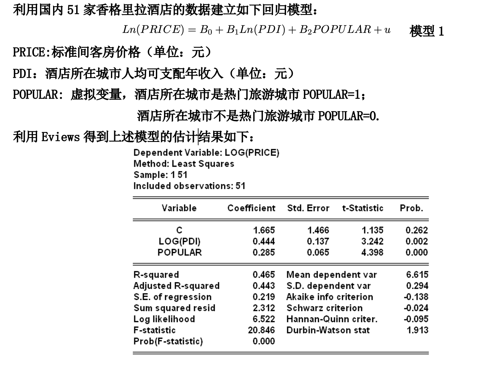
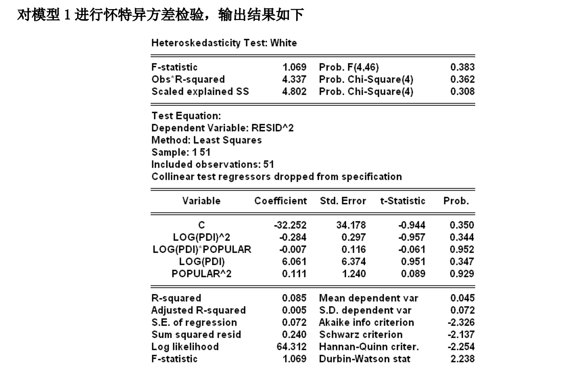

# 第9章 异方差

[讲义](https://lizongzhang.github.io/emetrics26/chap9slide.html){target="_blank"}

# 课堂练习

  
习题1

{.lightbox} 
{.lightbox} 

1. 写出怀特异方差检验的原假设和备择假设。

2. 写出怀特异方差检验中辅助回归方程的形式。

3. 怀特异方差检验统计量的理论分布是什么？

4. 怀特异方差检验统计量的值是什么？写出其计算表达式。 

5. 怀特异方差检验的P值是多少？解释其含义。

6. 怀特异方差检验的结论是什么？

# Eviews教学视频

[Eviews 残差的图形诊断](https://www.bilibili.com/video/BV1RV411y7hS/){target="_blank"} 
    
[Eviews 异方差检验](https://www.bilibili.com/video/BV1zT4y1F75Q/){target="_blank"}     
    
[Eviews 加权最小二乘](https://www.bilibili.com/video/BV1uf4y1q7vD/){target="_blank"}     
    
[Eviews 怀特异方差校正值](https://www.bilibili.com/video/BV1wf4y1q7YQ/){target="_blank"}

# R教学视频

[异方差------残差的图形诊断在R中的实现](https://www.bilibili.com/video/BV1oP4y1X7cU/){target="_blank"}

[怀特异方差检验在R中的实现](https://www.bilibili.com/video/BV1zG4y197Bf/){target="_blank"}

[加权最小二乘法在R中的实现](https://www.bilibili.com/video/BV1R44y1D7EY/){target="_blank"}

[怀特异方差校正后的标准误的计算在R中的实现](https://www.bilibili.com/video/BV1fd4y1x7Z7/){target="_blank"}

# 习题讲评视频

[教材习题9.6+9.7+9.8](https://www.bilibili.com/video/BV1ey4y1W75g){target="_blank"}

[教材习题9.9--基于EViews](https://www.bilibili.com/video/BV1ey4y1W75g){target="_blank"}

[教材习题9.14--基于EViews](https://www.bilibili.com/video/BV1ey4y1W75g){target="_blank"}

[教材习题9.28--基于EViews](https://www.bilibili.com/video/BV1ey4y1W75g){target="_blank"}

[9.27 Breush-Pagan异方差检验--基于R](https://www.bilibili.com/video/BV1AG411T7CT/){target="_blank"}

[9.27 如何应对异方差问题--基于R](https://www.bilibili.com/video/BV1QG4y1G7R9/){target="_blank"}

[9.28 怀特异方差校正后的标准误与OLS标准误的对比--基于R](https://www.bilibili.com/video/BV1u841157eV/){target="_blank"}

# 习题答案

点击展开

如果想在新窗口打开 PDF，请点这里： <a href="img/EE4_Ch09_Solutions_Manual.pdf" target="_blank" rel="noopener">在新标签页中查看 PDF</a>

<iframe src="img/EE4_Ch09_Solutions_Manual.pdf" width="100%" height="800" style="border: none;" allowfullscreen>
  <!-- 备用内容（若浏览器不支持 iframe） -->
  
你的浏览器无法嵌入 PDF，请 <a href="img/EE4_Ch09_Solutions_Manual.pdf" target="_blank" rel="noopener">点此下载/查看 PDF</a>.

</iframe>

    

# 拓展资源

[OLS与WLS比较--基于数值模拟](https://lizongzhang.github.io/emetrics26/wls_vs_ols.html){target="_blank"}

[White Robust Standard Errors](https://real-statistics.com/multiple-regression/robust-standard-errors/){target="_blank"}

# 第1-13周学情分析

[24人力资源1-2班](https://lizongzhang.github.io/emetrics26/week14_24hr.html){target="_blank"}

[24工商管理1-2班](https://lizongzhang.github.io/emetrics26/week14_24ba.html){target="_blank"}

