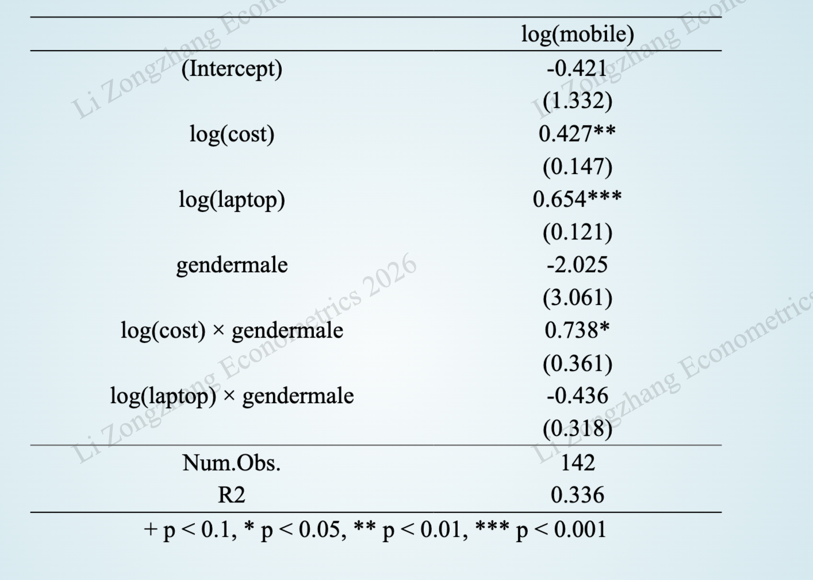

```{r}
#| message: false
#| warning: false
#| include: false

library(tidyverse)
library(showtext)
showtext_auto()

```

---

## 汇报安排

- 选拔机制：老师根据演示文稿质量，挑选4-5个优胜小组 进行课堂汇报。

- 提交截止：第14周周日（2026年6月7日）20:00 前提交PDF，逾期直接失去资格。

- 汇报时长：5分钟。展示小组成果，不要读演示文稿。

- 奖励：优胜小组每位成员实验报告加3-5分。

---

## 关键时间节点

- 提交截止：第14周周日（2026年6月7日）20:00

- 提交要求：

    - 文件格式：PDF（PowerPoint / WPS 转PDF）
  
    - 文件命名：第#组+组长姓名+班级+主题关键词+小组汇报.pdf
  
        - 示例：第1组池天俊 24人资1瑞幸小组汇报.pdf
  
    - 提交位置：QQ群“小组汇报”文件夹

- 结果公布：第15周周一（2026年6月8日）20:00

- 汇报时间：第15-16周课堂（5分钟，倒计时，超时扣分）

---

## “优胜小组”评选指标

- 选题的现实意义和创新性

- 变量选取的经济合理性与数据质量

- 规范的三线表

- 完整的模型诊断(残差图形、多余或遗漏变量的检验、多重共线性 VIF、异方差检验)

- 系数含义的准确解释

---

## 现场汇报 (5分钟)


- 第15-16周上课期间

- 每组**严格限时 5 分钟**。倒计时软件egg，超时会扣分。

- 只汇报实验报告的第2-5部分：**第6部分（代码）**和**第7部分（心得体会）**无需放进演示文稿中。

- 建议由1名表达能力最强的组员主讲，避免频繁换人浪费交接时间。

---

## 汇报文件排版

- 一页一个核心信息，避免信息过载

- 结构简洁：大标题 + 关键要点 + 1张核心图/表

- 字体大小适当：建议标题 ≥ 32pt，正文 ≥ 24pt

- 视觉风格：白底 + 深色文字，极简学术风，无需花哨动画和无关图片

- 15-20页左右

---

## 汇报文件结构


### 1 封面页 [建议：20秒]
* **视觉风格：** 简洁、素雅（建议浅色背景深色字体）。
* **内容：** 题目、小组全员姓名、学号、班级。

----

### 2 研究假说 [建议：40秒]

- 自变量 (X) 对 因变量 (Y) 具有显著的[正向促进 / 负向抑制]作用。

- 不同组别的的..., 自变量 (X) 对 因变量 (Y) 的影响效应不同。 

---

### 3 数据概况 [建议：30秒]

- 数据来源

- 变量定义：变量符号、中文名称、数据类型（定量/定性）、单位等。
    
- 定量变量：报告所有定量变量的均值、中位数、最小值、最大值、标准差。
    
- 定性变量：报告定性变量的频数与百分比分布。

---

### 4 实证分析[建议：60秒]

- 模型表达式

- 主要回归结果（学术论文三线表）

- 关键模型诊断

- 结果解释与讨论

---

#### 模型表达式

使用公式编辑器录入最优模型。

- PowerPoint/WPS 自带公式编辑器：插入/公式

- MathPix Snipping Tool（可以将手写公式转换成LaTeX格式）

- AI工具（如deepseek）生成LaTeX公式，复制粘贴到PPT中

$$
\begin{aligned}
Ln(Sales_{i}) = &B_0 + B_1 Ln(Advertising_{i}) + B_2Ln(Price_{i}) + \\
&B_3Ln(Competition_{i}) + u_{i}
\end{aligned}
$$


---

#### 回归模型估计结果

 **学术论文三线表**。包含：变量名、估计系数、标准误、显著性星号（$*$, $**$, $***$）、样本容量 $n$、$R^2$。



---

#### 模型诊断[建议：30秒]

**复制粘贴EViews或R的输出截图**

- 残差的图形诊断

- 多余或遗漏变量的检验

- 多重共线性诊断

- 异方差诊断

---

#### 估计结果解释[建议：60秒]

- 显著的系数：解释其含义

- 不显著的系数：结合现实探讨可能的原因

---

### 5 结论与启示 [建议：60秒]

- 结论：用要点形式归纳核心发现

- 启示：提出具体、可操作的现实建议。

---

:::{.callout-tip title="注意事项"}

- 代码和心得体会只写在实验报告中，汇报时无需呈现。

- 不要解释 $R^2$、$t$检验等基础概念。

- 无需使用翻转、飞入等动画（转PDF后失效）。

- 背景使用单色或极简模板。

- 提前练习，汇报时长控制在5分钟内。

:::

---

## 汇报演示文稿示例

```{r}
#| message: false
#| warning: false
#| include: false

library(tidyverse)
library(readxl)
library(modelsummary)
library(flextable)
library(knitr)
library(showtext)
showtext_auto()

df <- read_excel("data/mobile.xlsx")
```

---

### 封面 {.unnumbered}

:::{style="text-align:center; margin-top: 80px;"}

**预算约束、笔记本电脑支出与大学生手机消费<br>——基于性别差异的实证研究**

---

**小组成员**

**班级** 

**2026.6.** 


:::

---

### 研究假说

- **研究问题：** 哪些因素显著影响大学生的手机消费支出？

- **假说1：** 月生活费越高，手机消费支出越高。

- **假说2：** 笔记本电脑消费支出越高，手机消费支出越高。

- **假说3：** 不同性别群体中，生活费对手机消费支出的弹性不同。

- **假说4：** 不同性别群体中，笔记本电脑支出对手机消费支出的弹性不同。

---

### 数据概况

- **数据来源：** 26春教学班，157人，问卷星

- **样本容量：** 142

| 变量符号 | 变量名称 | 类型 | 单位 |
|----------|----------|------|------|
| `mobile` | 手机消费支出 | 定量 | 元 |
| `laptop` | 笔记本电脑消费支出 | 定量 | 元 |
| `cost` | 月生活费 | 定量 | 元 |
| `male` | 性别 | 定性 | 1-男性, 0-女性 |

---

#### 定量变量描述统计

```{r}
#| echo: false
#| message: false
#| warning: false

datasummary(mobile + laptop + cost ~
              N + Mean + SD + Median + Min + Max,
            data = df,
            fmt = 3,
            output = 'flextable') %>%
  theme_apa() %>%
  fontsize(size = 20, part = "all") %>%
  padding(padding = 10, part = "all") %>%
  line_spacing(space = 1.2, part = "all") %>%
  color(color = "#044875", part = "all") %>%
  autofit() %>%
  font(fontname = "Times New Roman", part = "all")
```

---

#### 定性变量描述统计

```{r}
#| echo: false
#| message: false
#| warning: false

datasummary(gender ~
              N + Percent(),
            data = df,
            fmt = 2,
            output = 'flextable') %>%
  theme_apa() %>%
  fontsize(size = 20, part = "all") %>%
  padding(padding = 5, part = "all") %>%
  line_spacing(space = 1.2, part = "all") %>%     
  color(color = "#044875", part = "all") %>%
  autofit() %>%
  font(fontname = "Times New Roman", part = "all")
```

---

### 模型表达式

最优模型：**双对数模型 + 性别交互项**

$$
\begin{aligned}
Ln(mobile_{i}) = &B_0  + B_1 Ln(cost_{i}) + B_2 Ln(laptop_{i}) + B_3 male_{i}\\
&B_4 male \times Ln(cost_{i})+ B_5 male_{i} \times Ln(laptop_{i}) + u_{i}
\end{aligned}
$$


---

### 回归模型估计结果

```{r}
#| echo: false
#| message: false
#| warning: false

m2.2 <- lm(log(mobile) ~ log(cost) + log(laptop) +
             gender + gender:log(cost) + gender:log(laptop), data = df)

modelsummary(
  list("log(mobile)" = m2.2),
  fmt = 3,
  stars = TRUE,
  gof_omit = 'AIC|BIC|Log.Lik|F|statistic|RMSE|Adj',
  gof_map = c("nobs", "r.squared"),
  output = "flextable"
) %>%
  theme_apa() %>%
  fontsize(size = 18, part = "all") %>%
  padding(padding = 5, part = "all") %>%
  line_spacing(space = 0.7, part = "all") %>%
  color(color = "#044875", part = "all") %>%
  autofit() %>%
  width(j = 1, width = 3.5) %>%
  width(j = 2, width = 2.5) %>%
  font(fontname = "Times New Roman", part = "all")
```

---

### 残差的图形诊断

```{r}
#| echo: false
#| message: false
#| warning: false
#| fig-width: 10
#| fig-height: 5

plot(m2.2, which = 1)
```

---

### 多余或遗漏变量的检验

```{r}
#| echo: false
#| message: false
#| warning: false

# 受限模型（不含 gender 和交互项）
m2.1 <- lm(log(mobile) ~ log(cost) + log(laptop), data = df)

# F检验：联合检验 gender 和 gender:log(laptop) 是否为多余变量
anova(m2.1, m2.2)

```

性别，以及性别与生活费支出的交互项是显著的，不能被视为多余变量。


---

### 多重共线性诊断（VIF）

```{r}
#| echo: false
#| message: false
#| warning: false

library(car)
vif_result <- vif(m2.2)
vif_df <- data.frame(
  变量 = names(vif_result),
  VIF = round(vif_result, 3)
)
kable(vif_df, align = "c")
```

多重共线性不严重。

---

### 异方差检验（Breusch-Pagan）

```{r}
#| echo: false
#| message: false
#| warning: false

library(lmtest)
bp_test <- bptest(m2.2)
print(bp_test)
```

不存在异方差问题，模型的OLS估计是有效的。

---

### 估计结果解释


- 月生活费对女生手机支出的弹性为 0.427，对男生为 1.165 ($0.427+0.738$)。
 
- 笔记本电脑支出对手机支出的弹性约为 0.654，无显著性别差异。

---

### 结论与启示

**结论**

- 预算约束对手机消费支出效应明显，且存在显著的性别差异。

    - 女生的生活费对手机消费支出弹性为 0.427，而男生为1.165。
    
    - 男生更强的“炫耀性消费”倾向。男生在拿到更多生活费时，倾向于将其转化为手机支出的升级。

- 笔记本电脑消费与手机消费呈现强协同效应。

    - 电脑消费支出对手机支出的弹性为 0.654，无性别显著差异。


---


**启示**

- 数码厂商的“性别差异化”精准营销策略：男生的手机消费极易受到“可支配资金”的影响。

- 校园零售可将电脑与手机进行捆绑销售。

---

:::{style="text-align: center; margin-top: 200px; font-size: 1.5em;"}

**敬请批评指正！**

:::

