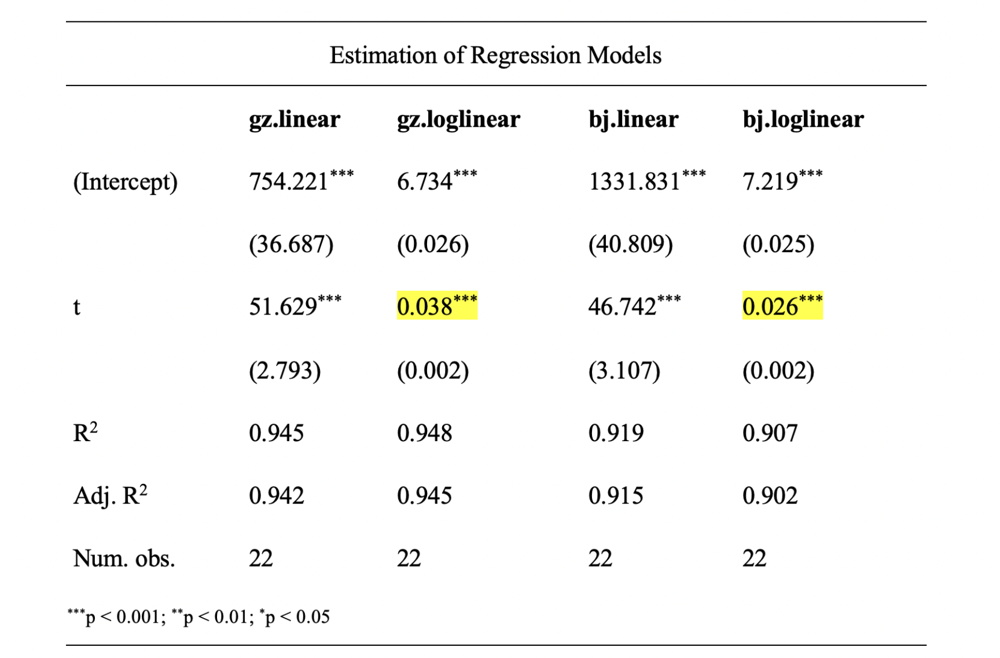

# 选题与数据

[详见:小组任务要求](https://lizongzhang.github.io/emetrics/case.html)

## 数据要求与来源
* **数据类型**：必须使用**截面数据**，严禁使用时间序列或面板数据。

* **样本容量**：有效个案数量不得低于 **60** 个（若是5人组，有效个案数量不得低于90）。
  * **重要提示**：请勿选择以“省级行政区划”为观测单元的选题（如各省居民消费分析），我国省级行政区总数为 34 个（23 个省、5 个自治区、4 个直辖市和 2 个特别行政区）

* **变量要求（数据收集阶段）**：
    * 至少包含 **3 个定量变量**（Continuous/Quantitative Variables）
    * 至少包含 **2 个定性变量**（Categorical/Qualitative Variables）
    * *提示：多收集备选变量可以避免后期分析因需要增加变量而二次收集数据。*
    
* **模型设定要求（实证分析阶段）**：
    * **被解释变量$Y$**：必须为**定量变量**
    * **解释变量构成**：最终进入回归模型的变量应至少包含 **2 个定量变量**和 **1个定性变量**
 
---
    
# 实验报告形式    

## **封面**

- 课程名称：计量经济学实验
- 学期：202# - 202#第#学期
- 题目：

- 小组成员(按学号由小到大排列)

  - 学号1 组员1
  - 学号2 组员2
  - 学号3 组员3
  - 学号4 组员4

## 1 选题背景与研究问题

* **撰写要求**：
    - 简述你观察到的某种经济或社会现象，并说明为什么研究这个现象是有趣且有现实价值的（研究动机）。
    - 明确本研究试图回答的一个或几个问题(如X1对Y有何影响？)。

## 2 理论逻辑与研究假说

* **撰写要求**：
    - 基于你的直觉判断或经济学常识，阐述变量间的内在影响机制。
    - 明确提出待检验的科学假说 $H_1$。
* **评分要点**：
    - 逻辑推演合理，能清晰解释“为什么对变量之间的关系有这样的预期”。
    - 假说表述具体、可观测、可证伪。

## 3 数据概况

* **撰写要求**：
    - 描述样本选取过程及样本容量。
    - **描述性统计**：报告所有变量的均值、中位数、最小值、最大值、标准差。
    - **可视化探究**：通过直方图、散点图、相关系数矩阵展示变量的分布，变量间的关联。
* **评分要点**：
    - 数据收集过程清晰，变量含义明确，统计量、图形完整。
    
## 4 实证分析：模型构建与检验

### 4.1 模型设定
- 写出经济计量模型的表达式：
  $$Y_{i} = B_0 + B_1 X_{1} +...+ B_2 X_{2} + u_{i}$$
- 选用你认为**最合适**的模型形式。

### 4.2 参数估计结果
- 按照学术规范列表报告模型估计结果（含系数、标准误/t值、显著性星号等）。
- 解释为什么该模型是一个“好的”模型。
- 选用你认为**最合适**的一个或几个模型 
- 不要写模型的尝试的过程，只写最终的模型设定

### 4.3 模型诊断（重点）
- 展示 R 或 EViews 的输出结果截图，并用“人话”简要解释：
    - 残差的图形诊断
    - 多余或遗漏变量的检验
    - 多重共线性诊断
    - 异方差检验

### 4.4 估计结果解释
- **显著系数**：解释其经济学含义，讨论与现实/猜想是否一致。
- **不显著系数**：结合现实分析可能的原因（如样本量不足、内生性或确实无影响）。    

## 5 **结论和启示**

- **结论**：概括实证研究最主要的发现，直接响应研究假说。
- **启示**：基于你的实证发现，提出 1-2 条具有现实意义的建议。

## 6 **EViews或R代码**
- EViews或R代码

## 7 **心得体会(各成员独立完成)**

  - 小组成员1学号 姓名 班级 个人心得体会
    - 本人在小组作业和实验报告中做的具体工作
    - 遇到过什么困难，如何解决的
    - 课程建议和感想
    - 个人心得体会字数不少于500字

---
  
# 提交要求

- 提交时限
  - 电子文件：第17周2026-6-22(周一)-20:00
    - 提交下述文件至QQ群“实验报告”文件夹中
      - 实验报告PDF版，文件命名“第#组+组长+班级+主题.pdf”, 如“第1组徐颖颜22金融3星巴克.pdf”, **不要提交WORD文件**
      - EXCEL数据文件，文件命名“第#组+组长+班级+主题.xlsx”, 如“第1组徐颖颜22金融3.xlsx”
      - R代码文件“第#组+组长+班级+主题.R” (可选，不是必须)
  - 实验报告打印稿：第17周2026-6-23(周二课间)

---
    
# 实验报告评价标准

## 评分体系总览

本实验报告采取百分制，旨在评估学生在**经济学逻辑构建**、**计量模型应用**、**软件操作规范**及**学术反思**四个维度的综合能力。

---

## 详细评分指标

### 1. 选题价值与变量构建 (20分)
* **选题意义**：研究课题具有明确的现实意义，非随意堆砌数据。
* **变量定义**：被解释变量、核心解释变量及控制变量选取有理论依据，变量定义准确。
* **数据质量**：数据来源可靠，样本量、变量的类型和个数满足课程要求。

### 2. 理论框架与研究假说 (10分)
* **逻辑推演**：基于经济理论清晰阐述变量间的内在影响机制。
* **假说表述**：提出明确的待检验科学假说 $H_1$，要求假说具体、可观测、可证伪。

### 3. 数据概览与特征分析 (10分)
* **描述性统计**：报告均值、标准差、最大/最小值等核心统计量，并对异常值进行识别与处理说明。
* **可视化呈现**：通过直方图、箱线图、散点图展现变量的分布，或变量之间间的关联。

### 4. 实证模型与计量分析 (30分)
* **模型设定**：模型形式表达规范
* **结果阐释**：参数估计值的含义解释准确；显著性水平（p值、t值）标注规范。
* **模型诊断**：系统进行模型诊断，至少包含以下内容：
    - 残差的图形诊断
    - 多余或遗漏变量的检验
    - 多重共线性诊断
    - 异方差检验

### 5. 结论提炼与对策建议 (10分)
* **结论准确性**：结论必须直接响应研究假说，严禁脱离实证结果过度推断。
* **启示**：基于实证发现提出针对性的建议，体现独立思考。

### 6. 个人心得与反思 (10分)
> **要求：各小组成员独立完成，字数不少于 500 字。**

* **具体贡献**：清晰界定个人在数据收集、建模、代码编写或文档撰写中的具体具体工作。
* **问题解决逻辑**：详细描述在实验中遇到的具体困难（如软件报错、系数不显著等）以及寻找解决方案的过程。
* **课程反馈**：对教学内容的应用心得及建设性改进建议。

### 7. 报告质量与技术附件 (10分)
* **规范性**：报告结构清晰，图表编号自动关联，语言表达专业。
* **可复现性**：**必须随报告提交Excel数据文件，以及EViews或R代码，老师运行代码后应能直接复现报告中的所有结果。

---

## 加分项：R 语言实践激励 (额外加分 5-10%)

为了鼓励学生探索现代数据科学工具，对于主动使用 R 语言 完成实验报告的小组，将在总分基础上获得额外加分。加分标准不仅取决于“使用了 R”，更取决于**“如何使用 R”**：

### 基础加分 (5%) —— 技术迁移奖

- 能够使用 R 完整复现实验报告要求的全部流程（从描述性统计到回归分析与诊断）。

- 代码运行无误，注释清晰，输出图表（如 ggplot2 绘制的图形）比 EViews 默认图表更具专业美感。

### 进阶加分 (6-10%) —— 技术规范奖

- 若代码展现出以下高级素养，分值将向 6% - 10% 上浮：

- 极致简洁与逻辑化 (Conciseness)：

- 避免冗余代码，使用管道符（|> 或 %>%）使处理流程一目了然。

- 变量命名规范，代码结构层级分明。

- 高质量注释。

### 加分后的总分上限不得超过 100 分。

---

## 等级换算表

| 分数区间 | 等级 | 说明 |
| :--- | :--- | :--- |
| 90-100 | 优秀 | 逻辑严密，模型诊断全面，内生性讨论深入，代码规范。 |
| 80-89 | 良好 | 步骤完整，统计结果正确，能够独立解决大部分计量问题。 |
| 70-79 | 中等 | 字数达标，模型设定基本合理，但分析深度不足。 |
| 60-69 | 及格 | 完成基本流程，数据真实，但模型诊断及规范性欠缺。 |
| < 60 | 不及格 | 存在抄袭嫌疑、数据造假或模型设定严重错误。 |

---    

